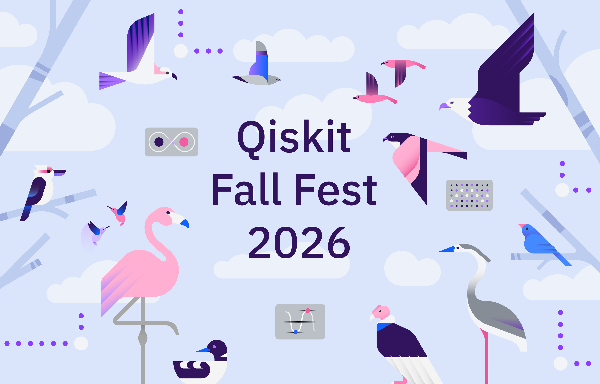
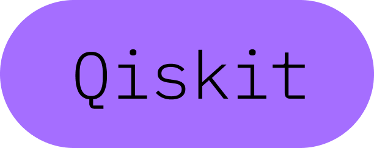
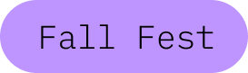
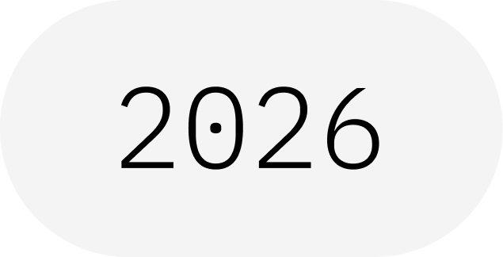

&nbsp;&nbsp;&nbsp;&nbsp;&nbsp;&nbsp;&nbsp; 
&nbsp;&nbsp;&nbsp;&nbsp;&nbsp;&nbsp;&nbsp;&nbsp;&nbsp;&nbsp;&nbsp;&nbsp;&nbsp;&nbsp;&nbsp;&nbsp;&nbsp;&nbsp;&nbsp;&nbsp;&nbsp;&nbsp;&nbsp;

<!--

&nbsp;&nbsp;&nbsp;&nbsp;&nbsp;&nbsp;&nbsp;&nbsp;&nbsp;&nbsp;&nbsp;&nbsp;

-->

<!-- &nbsp;&nbsp;&nbsp;&nbsp; -->
<!--  -->

# Qiskit Fall Fest 2026 - A Decade in the Cloud
*run by the Seattle Quantum Computing Meetup, sponsored by IBM Quantum*  

##### On May 4, 2016 IBM placed a 5-qubit quantum processor online for global access and started a decade of <a href="https://www.ibm.com/quantum/blog/decade-of-quantum" target="_blank">quantum computing in the cloud.</a>  

### Schedule of Events:

| Date | Time | Activity | Location |
| :-------------------------- | :---------------------------- | :---------------------------------------------- | :---------------------------------- |
| Oct 6 | 6:00 - 7:00 pm  | [Fall Fest 2026 Zoom Kickoff](https://www.meetup.com/seattle-quantum-computing-meetup/events/316412376/?eventOrigin=group_events_list) | Zoom | 
| Oct TBD | TBD  | Fall Fest 2026 In-Person Kickoff   Learn how to contribute to a real-world quantum computing project | TBD |
| Oct TBD | 5:00 - 7:00 pm | Quantum Computing Happy Hour | TBD | 
| Nov 30 | 10:00 am | Deadline for Winning Certificate work | submit online | 
| Nov 30 | TBD  | Closing Ceremony, by Serena Godwin, Qiskit Fall Fest Lead at IBM Quantum | On24 | 
| Up to Early Dec | -- | Participation and Winner Certificates Will Be Awarded | delivered online | 

*All times are Pacific time zone* 

### How it Works:
Earn a certificate from IBM Quantum while gaining skills in quantum computing using Qiskit.

This year we are going to focus on real-world quantum computing projects, so that you can learn how to start creating applications.

### Citizen Science Project: 

We introduce a Quantum-Assisted AI drug-discovery project written in Qiskit, Python, and Torch.  You can help scale this project.  

### Criteria for Certificates:

| Certificate Type | Criteria for Awarding | 
| :------------------------ |:-----------------------------------|
| Participation Certificate | Attend a zoom or in-person session | 
| Winning Certificate       | Complete a Qiskit Challenge notebook, submit work on a Hackathon prompt, write an article, or contribute to the Citizen Science drug-discovery project based in Qiskit, Python, and PyTorch |

### How to Submit your work?

Send a direct message in Discord (nhawkins) indicating your full name as you would like it to read on the certificate, also attach your work or provide a link to it.

### Qiskit Resources
- [Qiskit YouTube Channel](https://www.youtube.com/qiskit)
- [IBM Quantum Learning Platform](https://quantum.cloud.ibm.com/learning/en)

### Final Words

Have fun, enjoy the journey, and thank you so much for participating!

 

