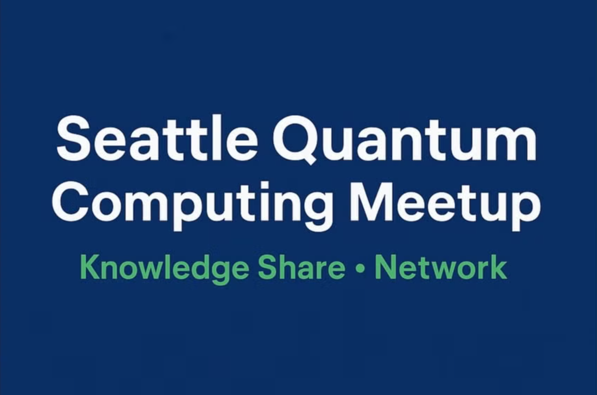
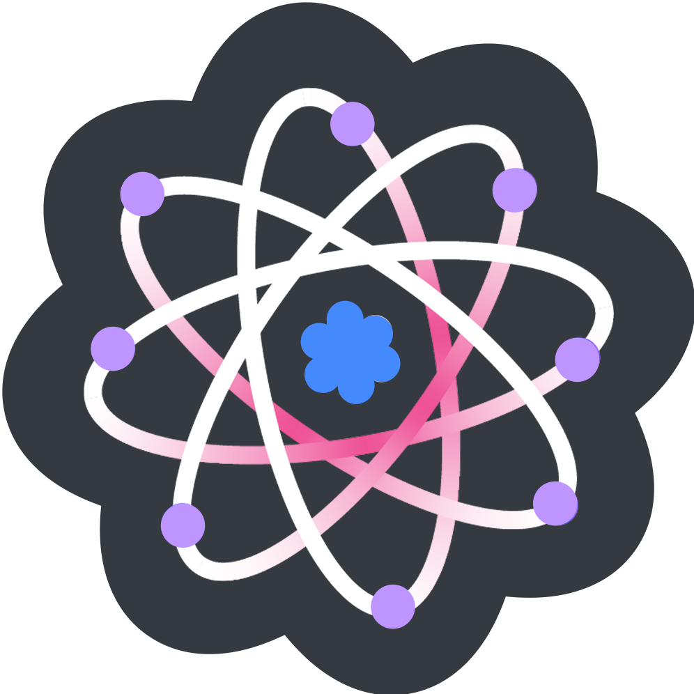
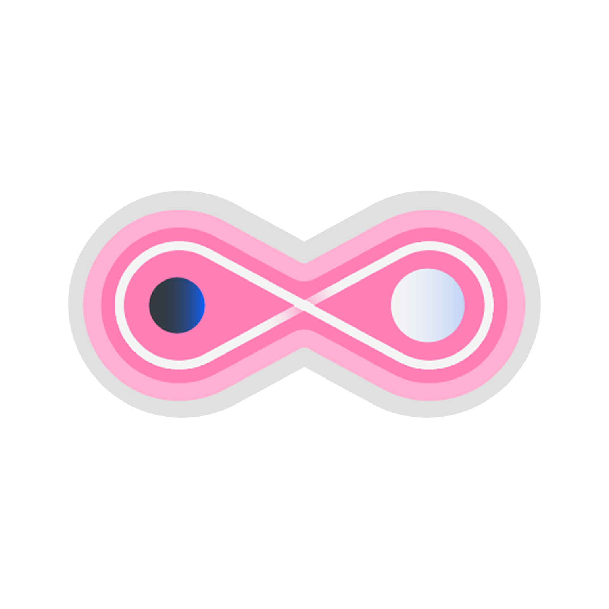

&nbsp;&nbsp;&nbsp;&nbsp;&nbsp;&nbsp;&nbsp;&nbsp;&nbsp;&nbsp;&nbsp;&nbsp; 

<!--  -->

# Qiskit Fall Fest 2026 - A Decade in the Cloud
Sponsored by IBM Quantum, run by the Seattle Quantum Computing Meetup

IBM marked a decade of <a href="https://www.ibm.com/quantum/blog/decade-of-quantum" target="_blank">quantum computing on the cloud</a>  on May 4, 2016, when it first placed a 5-qubit quantum processor online for global access.

### Schedule of Events:

| Date | Time | Activity | Location |
| :-------------------------- | :---------------------------- | :---------------------------------------------- | :---------------------------------- |
| Oct 6 | 6-7:00 pm  | Meetup Event- Fall Fest 2026 Zoom Kickoff | Zoom | 
| Oct 10 | TBD  | Meetup Event - Fall Fest 2026 In-Person Kickoff   Learn how to contribute to a real-world quantum computing project | TBD |
| Oct TBD | 5:00-7:00 pm | Meetup Event - Quantum Computing Happy Hour | TBD | 
| Nov 30 | 10:00 am | Deadline for Winning Certificate work | submit online | 
| Nov 30 | TBD  | Closing Ceremony, by Serena Godwin, Qiskit Fall Fest Lead at IBM Quantum | On24 | 
| Up to Early Dec | -- | Participation and Winner Certificates Will Be Awarded | delivered online | 

*All times are Pacific time zone* 

### How it Works:
Earn a certificate from IBM Quantum while gaining skills in quantum computing using Qiskit.

This year we are going to focus on presenting a real-world quantum computing project, so you can learn how to start creating applications.

We will also make available the usual Qiskit Challenge notebook(s), and Hackathon prompt(s).  

### Citizen Science Project: 

This year we introduce a Quantum-Assisted AI drug-discovery project written in Qiskit, Python, and Torch.  You can help scale this project.  

### Criteria for Certificates:

| Certificate Type | Criteria for Awarding | 
| :------------------------ |:-----------------------------------|
| Participation Certificate | Attend a zoom or in-person session | 
| Winning Certificate       | Complete a Qiskit Challenge notebook, or submit work on a Hackathon prompt, or write an article, or contribute to the Citizen Science drug-discovery project based in Qiskit, Python, and Torch |

### How to Submit your work?

Send a direct message in Discord (nhawkins) indicating your full name as you would like it to read on the certificate, also attach your work or provide a link to it.

### Qiskit Resources
- [Qiskit YouTube Channel](https://www.youtube.com/qiskit)
- [IBM Quantum Learning Platform](https://quantum.cloud.ibm.com/learning/en)

### Final Words

Have fun, enjoy your journey, and thank you for participating!

 

