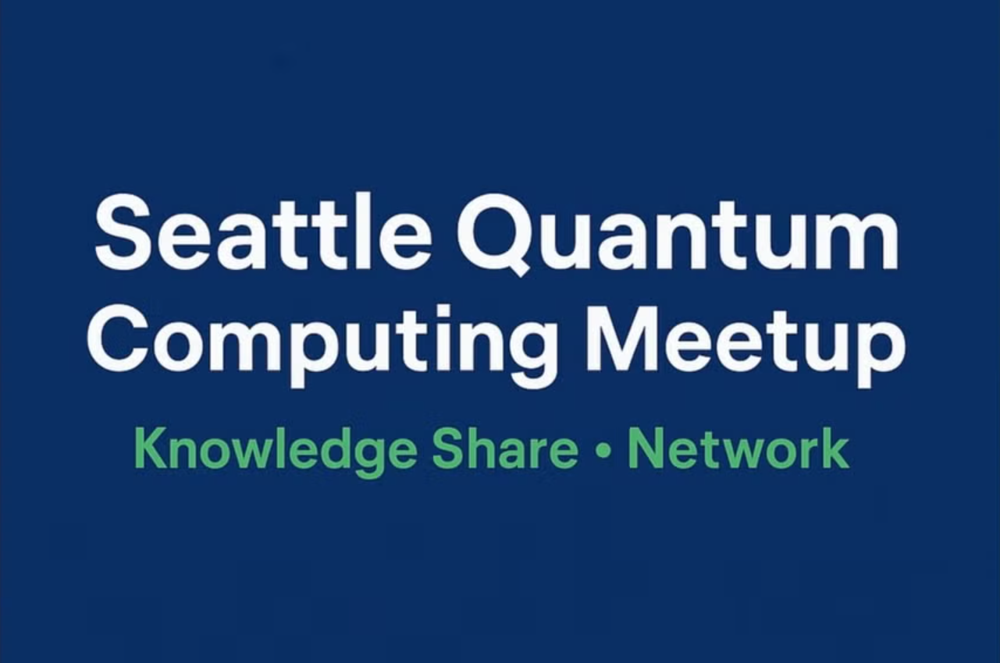
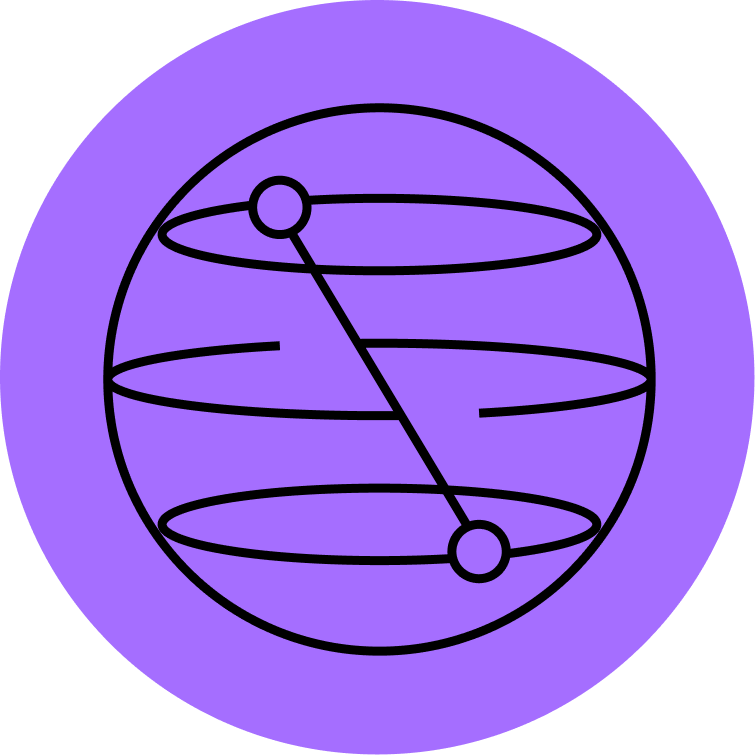
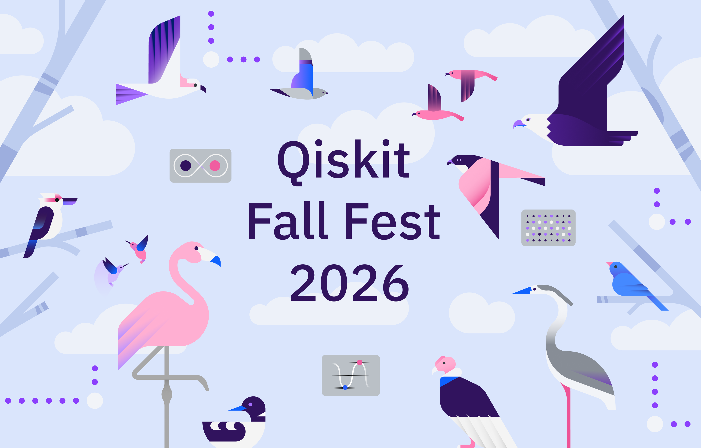
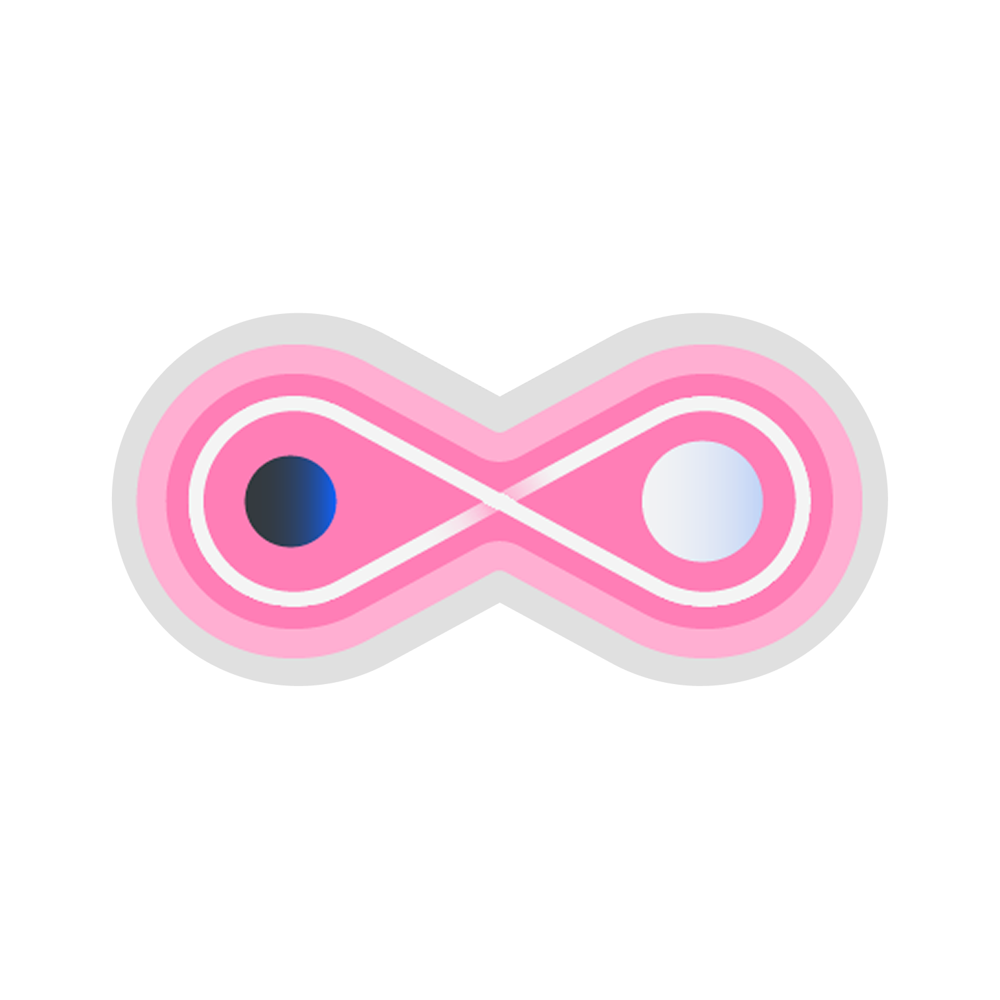
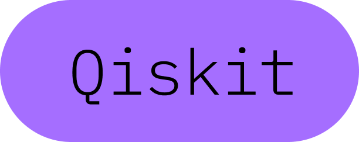
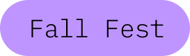
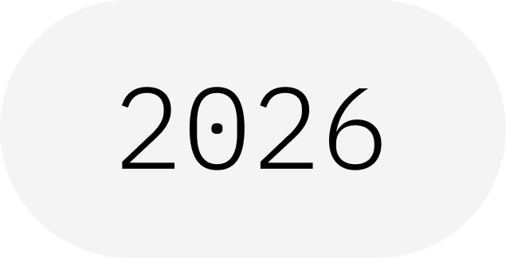
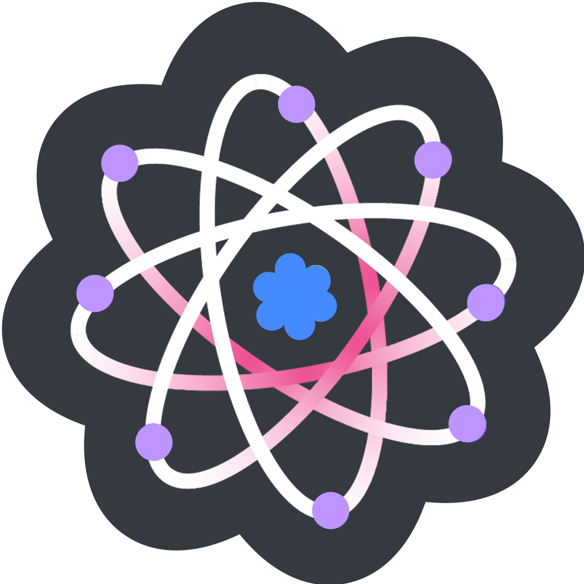

&nbsp;&nbsp;&nbsp;&nbsp; 
&nbsp;&nbsp;&nbsp;&nbsp;&nbsp;&nbsp;&nbsp;&nbsp;&nbsp;&nbsp;&nbsp;&nbsp;

<!-- &nbsp;&nbsp;&nbsp;&nbsp; -->
<!--

&nbsp;&nbsp;&nbsp;&nbsp;&nbsp;&nbsp;&nbsp;&nbsp;&nbsp;&nbsp;&nbsp;&nbsp;

-->

<!-- &nbsp;&nbsp;&nbsp;&nbsp; -->
<!--  -->

# Qiskit Fall Fest 2026 - A Decade in the Cloud
*run by the Seattle Quantum Computing Meetup, sponsored by IBM Quantum*  
Organizers: Natalie Hawkins - Lead, Kathleen G - UW Liaison, Arry Y - Event Advisor

##### On May 4, 2016 IBM placed a 5-qubit quantum processor online for global access and started a decade of <a href="https://www.ibm.com/quantum/blog/decade-of-quantum" target="_blank">quantum computing in the cloud.</a>  

### What to do:
1. [Register here](https://forms.gle/wfyYZZ68VCtTRZ3q7) so that we have your name when awarding an IBM Quantum Certificate
2. [If you haven't previously, join the SQCM Discord](https://discord.gg/UWpn5R6bp) to engage with others during the fall fest
3. [Join the Qiskit Fall Fest 2026 Kickoff zoom](https://www.meetup.com/seattle-quantum-computing-meetup/events) on Tu, Oct 6, at 12noon, 4pm, or 6pm PT

### Schedule of Events:

| Date | Time | Activity | Location |
| :-------------------------- | :---------------------------- | :---------------------------------------------- | :---------------------------------- |
| Oct 6 | 12noon, 4pm, or 6pm  | [Qiskit Fall Fest 2026 Zoom Kickoff](https://www.meetup.com/seattle-quantum-computing-meetup/events) | Zoom | 
| Oct 8 | 4pm-6pm | [Quantum Computing Happy Hour, RSVP](https://www.meetup.com/seattle-quantum-computing-meetup/events/316848957/) | Seattle TBD | 
| Oct 13 | 5pm-7pm | [Quantum Computing Happy Hour, RSVP](https://www.meetup.com/seattle-quantum-computing-meetup/events/316849069/) | Forum Social House, Lincoln Square, Bellevue, WA | 
| Oct 20, 21, or 22? | 4pm?, 5pm?, or 6pm?  | Industry Presentations related to Quantum Computing Research, Programming, Jobs, and Qiskit | TBD |
| Nov 3 | 12:00 - 1:00 pm  | IBM Quantum Presentation, Alex Choquette, Global Strategic Research Development, IBM Quantum | online, [RSVP here](https://www.meetup.com/seattle-quantum-computing-meetup/events/316774512/) |
| Nov 24 or Dec 1 or later | TBD  | Participant Qiskit Project Presentations | TBD |
| Nov 30 | 10:00 am | Deadline for Winning Certificate work | submit online | 
| Dec 8 | 6:30 am  | Closing Ceremony, by Serena Godwin, Qiskit Fall Fest Lead at IBM Quantum | On24 | 
| Up to Early Dec | -- | Participation and Winner Certificates Will Be Awarded | delivered online | 

*All times are Pacific time zone* 

### How it Works:
Earn a certificate from IBM Quantum while gaining skills in quantum computing using Qiskit.

This year's Qiskit Challenge notebooks focus on the SQD algorithm applied to a short chain of magnets, and to H2, stretched-N2, and H2O to find the ground state energy of each.

### How to Earn a Winning Crtificate from IBM Quantum 

How can I earn a Winning Certificate? It’s completely flexible - pick one, or design one of your own!

1. Complete one or more of the Qiskit Jupyter Notebooks on the SQD Algorithm
2. Complete one or more classes on the [IBM Quantum Learning platform](https://quantum.cloud.ibm.com/learning/en/courses)
3. Complete a [tutorial on the IBM Quantum platform](https://quantum.cloud.ibm.com/docs/en/tutorials)
4. Work on a [hackathon prompt from the SQCM QFF26 directory](https://github.com/SeattleQuantumComputingMeetup/qiskit_fallfest_2026/tree/main/hackathon_prompts)
5. Write a proposal for a start-up related to quantum technologies, [something like this...](https://dorahacks.io/hackathon/564/businesschallenge)
6. Write an article, say, for Medium or Substack, or just for yourself, related to quantum computing, could be a report on a Qiskit Quantum Seminar that you watched on the Qiskit YouTube channel, or on the QPU Roadmap
7. Vibe code a research paper, take the [Qiskit Developer Certification exam](https://www.ibm.com/training/certification/ibm-certified-quantum-computation-using-qiskit-v2x-developer-associate-C9008400), join the [Qiskit Advocate Program](https://www.ibm.com/quantum/blog/qiskit-advocate-program)
8. Create a piece of art or music related to quantum technologies

### Group Projects: 

We will survey the participants for interest in working on longer-term group projects, and if there's interest, facilitate that.

### Criteria for Certificates:

| Certificate Type | Criteria for Awarding | 
| :------------------------ |:-----------------------------------|
| Participation Certificate | Attend a zoom or in-person session | 
| Winning Certificate       | Complete a Qiskit Challenge notebook, submit work on a Hackathon prompt, write an article, or contribute to the Citizen Science drug-discovery project based in Qiskit, Python, and PyTorch |

### How to Submit your work?

Send a direct message in Discord (nhawkins) indicating your full name as you would like it to read on the certificate, also attach your work or provide a link to it.

### Qiskit Resources
- [Qiskit YouTube Channel](https://www.youtube.com/qiskit)
- [IBM Quantum Learning Platform](https://quantum.cloud.ibm.com/learning/en)

### Final Words

Have fun, enjoy the journey, and thank you so much for participating!

 

